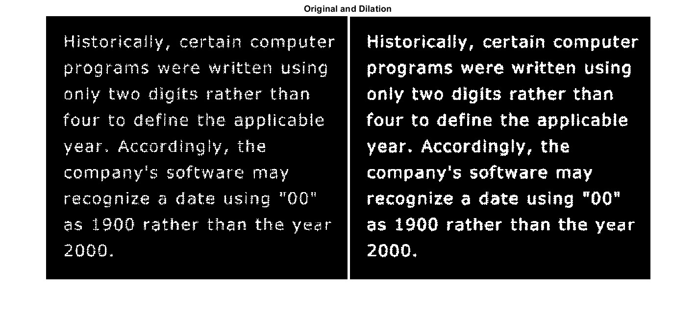
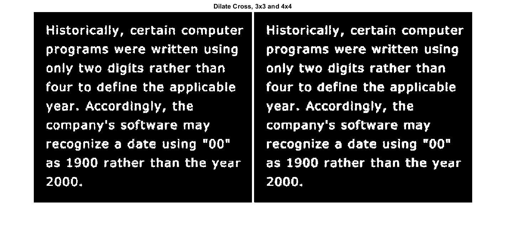
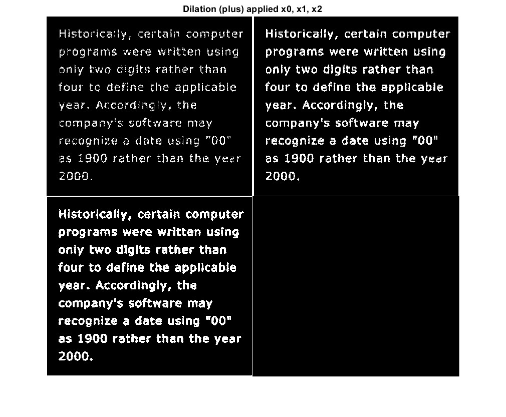
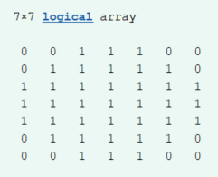
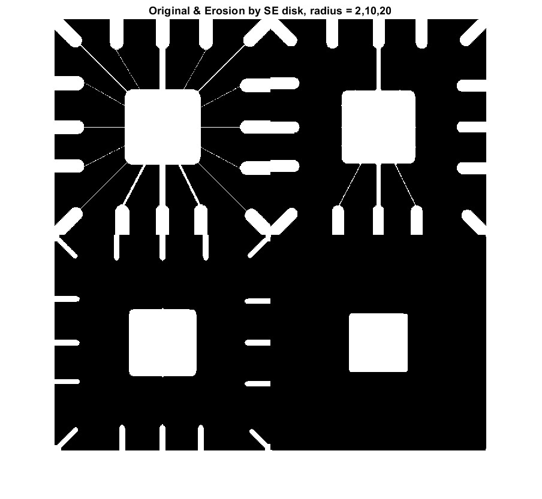
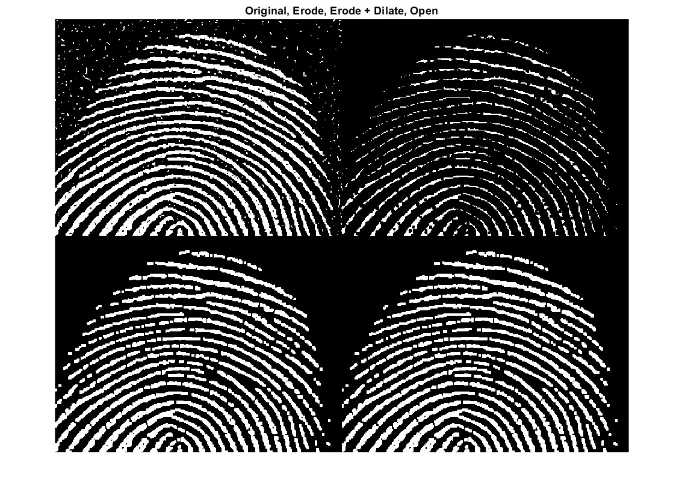
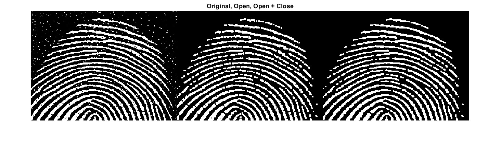
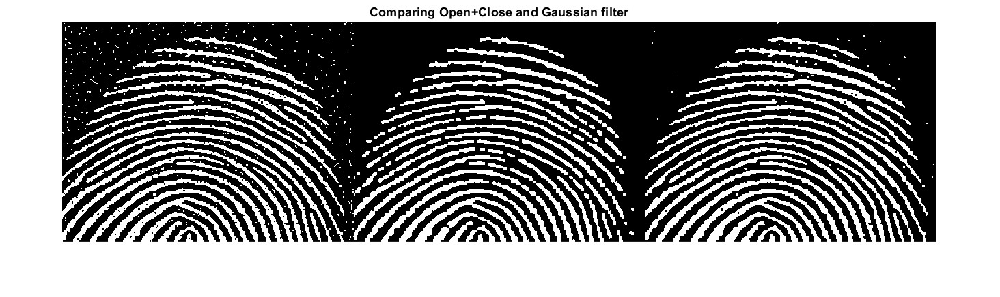
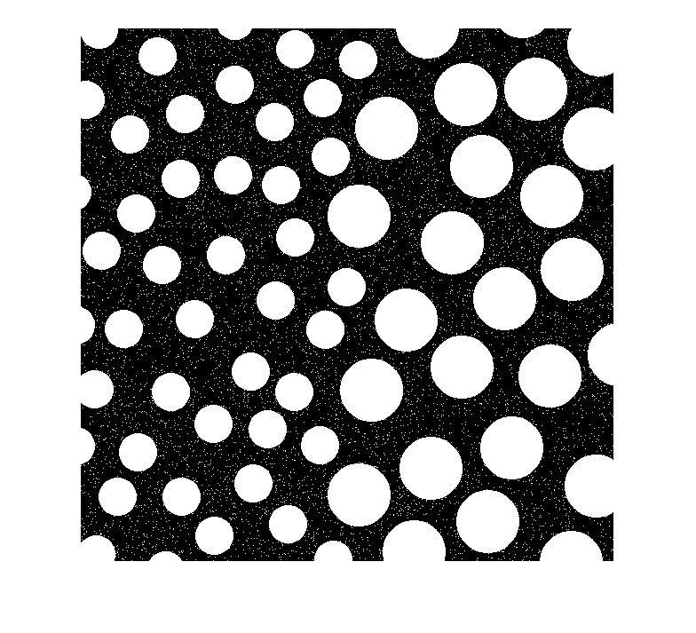
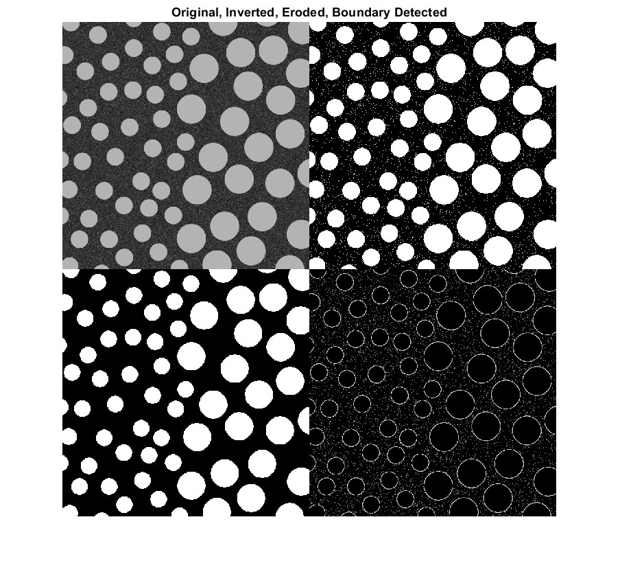

# Lab 4 - Morphology Image Processing

## 1 - Dilation and Erosion


### Dilation Operation

Dilation in a plus shape
```
clear all
close all

A = imread('assets/text-broken.tif');
B1 = [0 1 0;
	1 1 1;
	0 1 0]; % create structuring element

A1 = imdilate(A, B1);

figure
montage({A,A1})
title('Original and Dilation (plus)')
```


- The text is now dilated wider

Dilation A2 by a 3x3 matrix of ones
```
B2 = ones(3,3);
A2 = imdilate(A, B2);

figure
montage({A,A2})
title('Original and Dilation (ones)')
```


- Not much change from above, corners are slightly more dilated

Dilation by a cross shape, in 3x3 and 4x4 matrix
```
Bx = [1 0 1;
	0 1 0;
	1 0 1];

Bx_L = [1 0 0 1;
	0 1 1 0;
	1 0 0 1];

Ax = imdilate(A, Bx);
Ax_L = imdilate(A, Bx_L);

figure
montage({Ax,Ax_L})
title('Dilate Cross, 3x3 and 4x4')
```


- A larger SE gives a little bit more dilation

Apply Dilation B1 multiple times
```
figure

A11 = imdilate(A1, B1);

montage({A, A1, A11})

title('Dilation (plus) applied x0, x1, x2')
```



### Generating Structural Elements
`strel` generates structuring elements for us


Disk with radius `r=4`
```
SE = strel('disk',4);
SE.Neighborhood         % print the SE neighborhood contents
```


- Note that the returned strel is an internal data structure of its own, not a matrix. This speeds up execution.

### Erosion

```
clear all
close all

A = imread('assets/wirebond-mask.tif');

% Generate strels
SE2 = strel('disk',2);
SE10 = strel('disk',10);
SE20 = strel('disk',20);

% erode
E2 = imerode(A,SE2);
E10 = imerode(A,SE10);
E20 = imerode(A,SE20);

montage({A, E2, E10, E20}, "size", [2 2])
title('Original & Erosion by SE disk, radius = 2,10,20')
```


- radius 2 removes the thinnest lines, but some of the thicker ones remain, the thick bits get thinner
- radius 10 removes all lines but outer lines are thinner
- radius 20 removes everything on the outside but the square is smaller

## 2 - Filtering with Open and Close
Opening = Erosion + Dilation
Opening - smoothes contour, breaks narrow passages, eliminates thin protusions

Closing = Dilation + Erosion
Closing = smooth sections of contours, fuses narrow breaks and long thin gulfs, eliminates small holes, fills gaps in contour

Comparing Erode, Erode + Dilation, Open
```
clear all
close all

f = imread('assets/finger-noisy.tif');
SE = strel('square', 3);

fe = imerode(f,SE); % erode
fed = imdilate(fe,SE); % dilate
fo = imopen(f, SE);

figure
montage({f, fe, fed, fo}, "size", [2 2])
title('Original, Erode, Erode + Dilate, Open')
```



- Erode + Dilate has basically the exact results with Open, cleaning up the noisy bits and keeping it thick

Closing
```
foc = imclose(fo, SE);

figure
montage({f, fo, foc})
title('Original, Open, Open + Close')
```


- Closing seals up tiny gaps and smoothens some stuff

Comparing Open+Close with Gaussian Filter
```
w_gauss = fspecial('Gaussian', [3 3], 1.0);
g_gauss = imfilter(f, w_gauss, 0);

figure
montage({f, foc, g_gauss}, "Size", [1 3])
title('Comparing Open+Close and Gaussian filter')
```


- Gaussian is messier than open/close

TBD - Other SE shapes?
## 3 - Boundary Detection
Finding the boundaries of the blobs using boundary operator.
Original image is very noisy and have contrast of black blobs on white background (which is inverted in terms of processing)


Invert the greyscale image into binary with white objects and black background

```
clear all
close all
I = imread('assets/blobs.tif');
I = imcomplement(I); % invert
level = graythresh(I); % threshold
BW = imbinarize(I, level); % binarize
imshow(BW)
```



- `graythresh` computes a global threshold _level_ from the grayscale image I, by finding a threshold that minimizes the variance of the thresholded black and white pixels.
- `imbinarize`turns the grayscale image to a binary image BW. 
	- Pixels >= `level` are foreground (1) and others are background (0)


- The end result still has the noise bits
- improvement - slightly erode BW first to remove noise
## 4 - bwmorph - Thinning and Thickening

## 5 - Connected Components and Labels

## 6 - Morphological Reconstruction

## 7 - Morphological Operations on Greyscale Images

## Challenges
