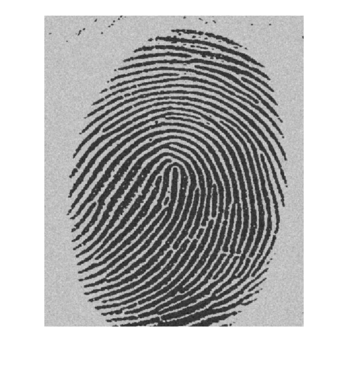
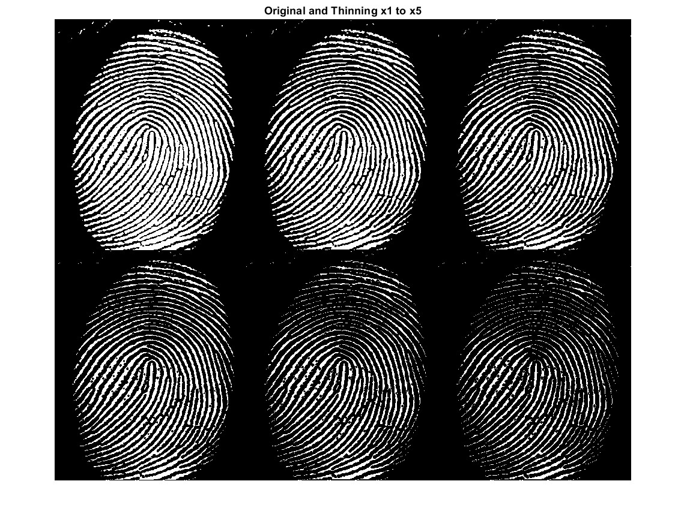
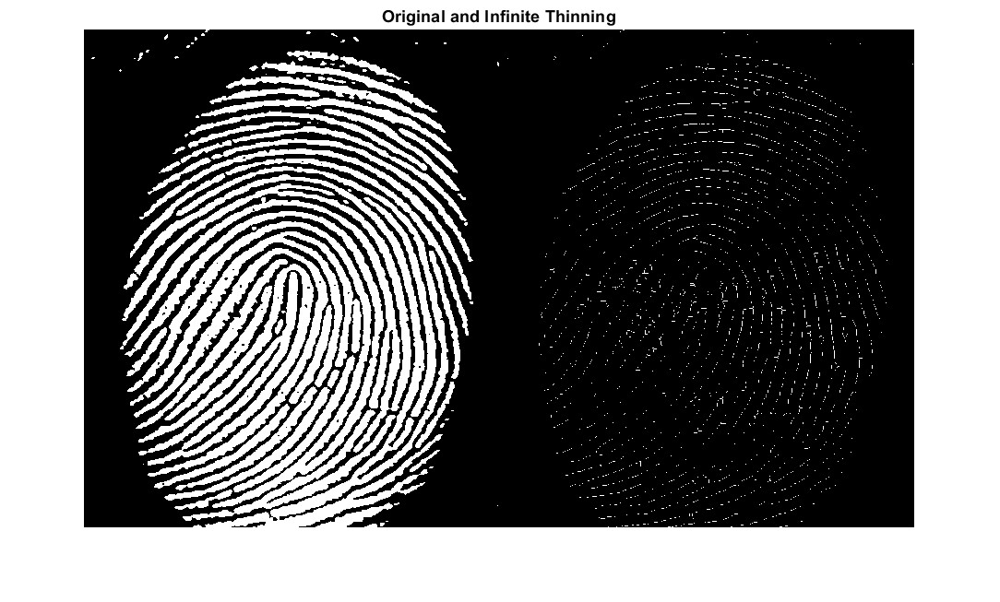
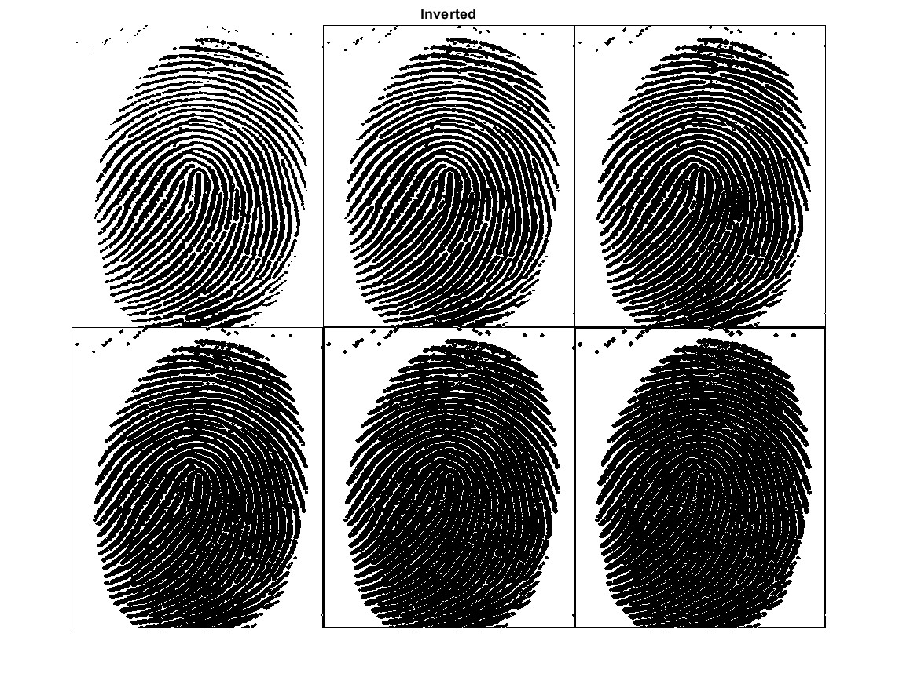
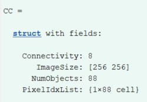
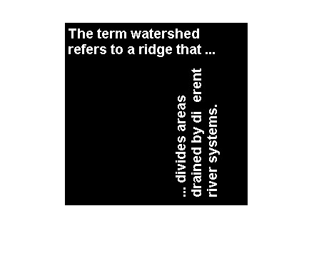
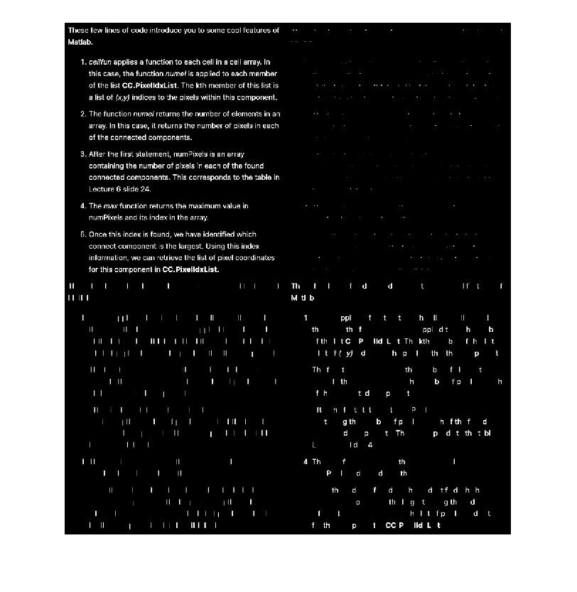
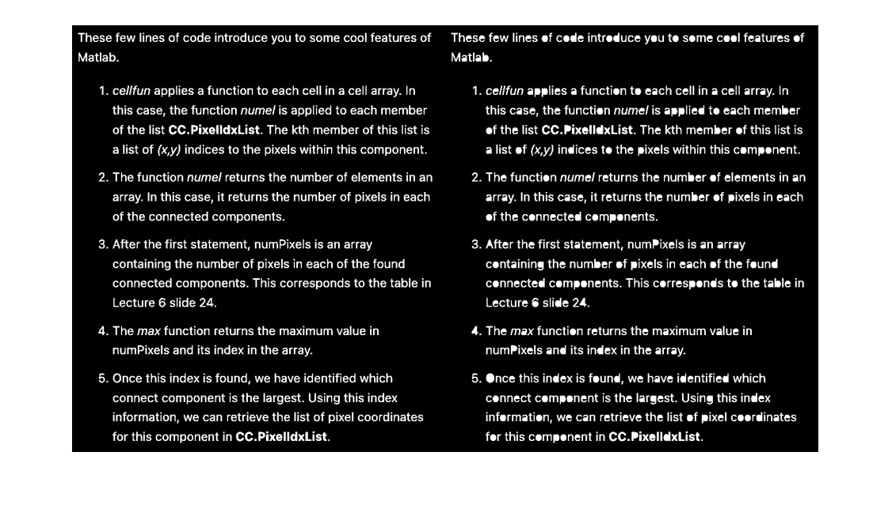
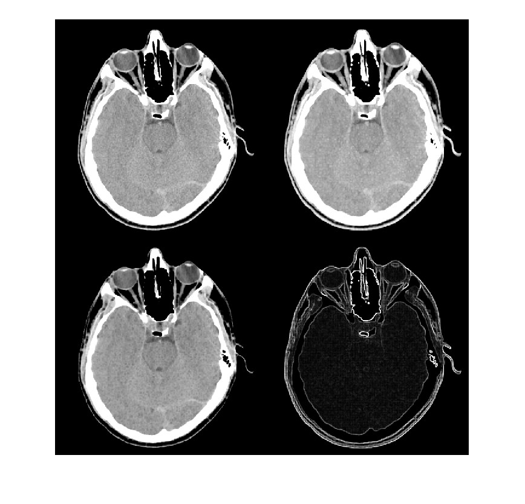

# Lab 4 - Morphology Image Processing

## 1 - Dilation and Erosion


### Dilation Operation

Dilation in a plus shape
```
clear all
close all

A = imread('assets/text-broken.tif');
B1 = [0 1 0;
	1 1 1;
	0 1 0]; % create structuring element

A1 = imdilate(A, B1);

figure
montage({A,A1})
title('Original and Dilation (plus)')
```


- The text is now dilated wider

Dilation A2 by a 3x3 matrix of ones
```
B2 = ones(3,3);
A2 = imdilate(A, B2);

figure
montage({A,A2})
title('Original and Dilation (ones)')
```


- Not much change from above, corners are slightly more dilated

Dilation by a cross shape, in 3x3 and 4x4 matrix
```
Bx = [1 0 1;
	0 1 0;
	1 0 1];

Bx_L = [1 0 0 1;
	0 1 1 0;
	1 0 0 1];

Ax = imdilate(A, Bx);
Ax_L = imdilate(A, Bx_L);

figure
montage({Ax,Ax_L})
title('Dilate Cross, 3x3 and 4x4')
```


- A larger SE gives a little bit more dilation

Apply Dilation B1 multiple times
```
figure

A11 = imdilate(A1, B1);

montage({A, A1, A11})

title('Dilation (plus) applied x0, x1, x2')
```


### Generating Structural Elements
`strel` generates structuring elements for us


Disk with radius `r=4`
```
SE = strel('disk',4);
SE.Neighborhood         % print the SE neighborhood contents
```


- Note that the returned strel is an internal data structure of its own, not a matrix. This speeds up execution.

### Erosion

```
clear all
close all

A = imread('assets/wirebond-mask.tif');

% Generate strels
SE2 = strel('disk',2);
SE10 = strel('disk',10);
SE20 = strel('disk',20);

% erode
E2 = imerode(A,SE2);
E10 = imerode(A,SE10);
E20 = imerode(A,SE20);

montage({A, E2, E10, E20}, "size", [2 2])
title('Original & Erosion by SE disk, radius = 2,10,20')
```


- radius 2 removes the thinnest lines, but some of the thicker ones remain, the thick bits get thinner
- radius 10 removes all lines but outer lines are thinner
- radius 20 removes everything on the outside but the square is smaller

## 2 - Filtering with Open and Close
Opening = Erosion + Dilation
Opening - smoothes contour, breaks narrow passages, eliminates thin protusions

Closing = Dilation + Erosion
Closing = smooth sections of contours, fuses narrow breaks and long thin gulfs, eliminates small holes, fills gaps in contour

Comparing Erode, Erode + Dilation, Open
```
clear all
close all

f = imread('assets/finger-noisy.tif');
SE = strel('square', 3);

fe = imerode(f,SE); % erode
fed = imdilate(fe,SE); % dilate
fo = imopen(f, SE);

figure
montage({f, fe, fed, fo}, "size", [2 2])
title('Original, Erode, Erode + Dilate, Open')
```


- Erode + Dilate has basically the exact results with Open, cleaning up the noisy bits and keeping it thick

Closing
```
foc = imclose(fo, SE);

figure
montage({f, fo, foc})
title('Original, Open, Open + Close')
```


- Closing seals up tiny gaps and smoothens some stuff

Comparing Open+Close with Gaussian Filter
```
w_gauss = fspecial('Gaussian', [3 3], 1.0);
g_gauss = imfilter(f, w_gauss, 0);

figure
montage({f, foc, g_gauss}, "Size", [1 3])
title('Comparing Open+Close and Gaussian filter')
```


- Gaussian is messier than open/close

TBD - Other SE shapes?
## 3 - Boundary Detection
Finding the boundaries of the blobs using boundary operator.
Original image is very noisy and have contrast of black blobs on white background (which is inverted in terms of processing)


Invert the greyscale image into binary with white objects and black background

```
clear all
close all
I = imread('assets/blobs.tif');
I = imcomplement(I); % invert
level = graythresh(I); % threshold
BW = imbinarize(I, level); % binarize
imshow(BW)
```


- `graythresh` computes a global threshold _level_ from the grayscale image I, by finding a threshold that minimizes the variance of the thresholded black and white pixels.
- `imbinarize`turns the grayscale image to a binary image BW. 
	- Pixels >= `level` are foreground (1) and others are background (0)


- The end result still has the noise bits
- improvement - slightly erode BW first to remove noise
## 4 - bwmorph - Thinning and Thickening
`bwmorph` is a general morphological function which implements operations based on combinations and erosions

```
% Call Syntax:
g = bwmorph(f, operation, n)
```
- `f` is the input binary image
- `operation` is the string specifying desired operation (see below)
- `n` is a positive integer specifying times to repeat the operation (default 1)



The original image needs to be inverted like in task 3.

```
f = imread('assets/fingerprint.tif');
f = imcomplement(f);
level = graythresh(f);
BW = imbinarize(f, level);
imshow(BW)
```

Perform thinning multiple times


Perform thinning infinite times (operation will stop when image stops changing)


Perform this operation with a black on white background instead.

- This shows how thinning is basically an inverse version of thickening
## 5 - Connected Components and Labels
In processing and interpreting an image, it is often required to find objects in an image. 
After binarization, these objects will form regions of 1's in background of 0's. 
- These are connected components within the image.

Find the **largest connected component** in this image, and then **erase it**


`bwconncomp` performs morphological operation that extracts connected components
```
t = imread('assets/text.png');
imshow(t)
CC = bwconncomp(t)
```

CC is a data structure returned by the function as below


Determine which is the largest component in the image and then erase it (i.e. set all pixels within that component to 0)

```
numPixels = cellfun(@numel, CC.PixelIdxList);
[biggest, idx] = max(numPixels);
t(CC.PixelIdxList{idx}) = 0;
figure
imshow(t)
```


- Notice that ff is removed

1. **_cellfun_** applies a function to each element in an array. 
	- In this case, the function _numel_ is applied to each member of the list **_CC.PixelIdxList_**. The kth member of this list is itself a list of _(x,y)_ indices to the pixels within this component.
2. The function **_numel_** returns the number of elements in an array or list. 
	- In this case, it returns the number of pixels in each of the connected components.
3. The first statement returns **_numPixels_**, which is an array containing the number of pixels in each of the detected connected components in the image. 
4. The **_max_** function returns the maximum value in numPixels and its index in the array.
5. Once this index is found, we have identified the largest connect component. Using this index information, we can retrieve the list of pixel coordinates for this component in **_CC.PixelIdxList_**.
## 6 - Morphological Reconstruction
**_Morphological reconstruction_** (MR) is a better method that restores the original shapes of the objects that remain after erosion.

MR requires three things: an input image `f` to be processed called the `mask`, a marker image `g`, and a structuring element `se`. The steps are:
1. Find the marker image **_g_** by eroding the mask with an **_se_** that mark the places where the desirable features are located. 
	- In our case, the desired characters are all with long vertical elements that are 17 pixels tall. Therefore the **_se_** used for erosion is a 17x1 of 1's.
2. Apply the reconstruction operation using Matlab's **_imreconstruct_** function between the **marker** **_g_** and the **mask** **_f_**.

A binary image of printed text is processed so that the letters that are long and thin are kept, while all others are removed.

```
clear all
close all
f = imread('assets/text_bw.tif');
se = ones(17,1);
g = imerode(f, se);
fo = imopen(f, se);     % perform open to compare
fr = imreconstruct(g, f);
montage({f, g, fo, fr}, "size", [2 2])
```


- fr (last one) adds back letters that fit the criteria

`imfill` fills holes in images
```
ff = imfill(f);
figure
montage({f, ff})
```


## 7 - Morphological Operations on Greyscale Images
Binary images vividly show the effect of morphological operations, but we can also do them on greyscale images

Erosion and Dilation on Greyscale images:
```
clear all; close all;
f = imread('assets/headCT.tif');
se = strel('square',3);
gd = imdilate(f, se);
ge = imerode(f, se);
gg = gd - ge;
montage({f, gd, ge, gg}, 'size', [2 2])
```



## Challenges
